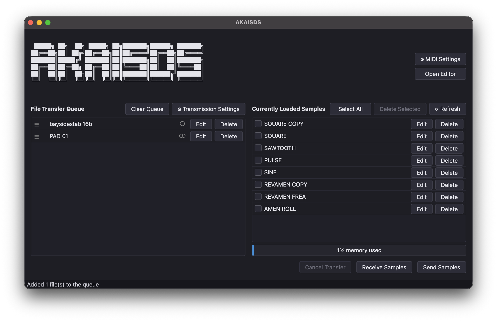
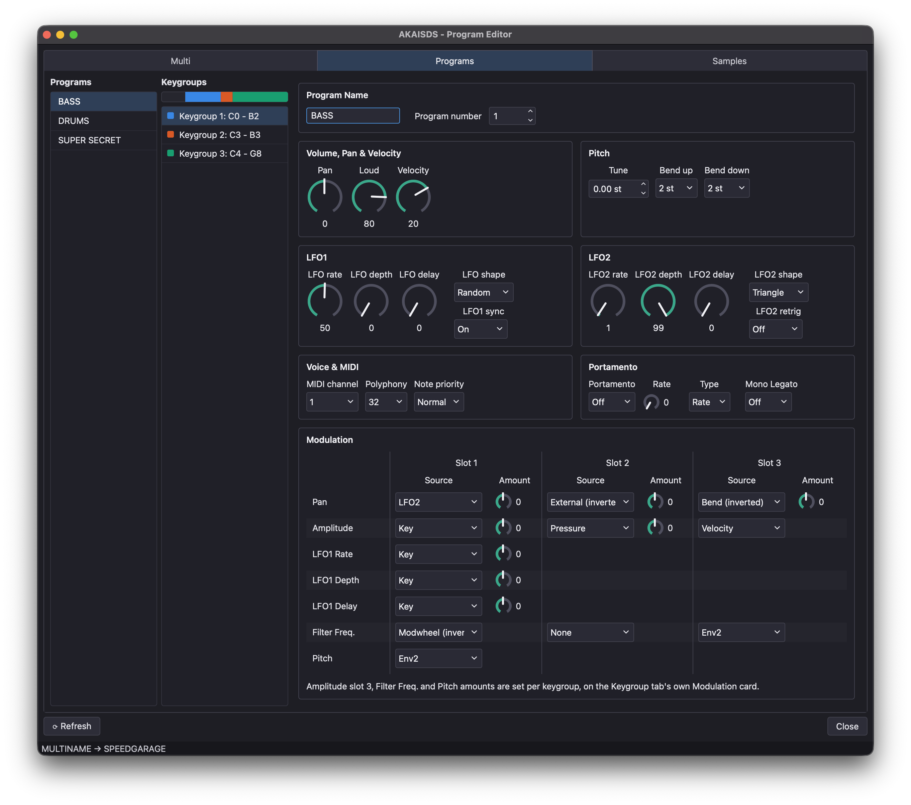
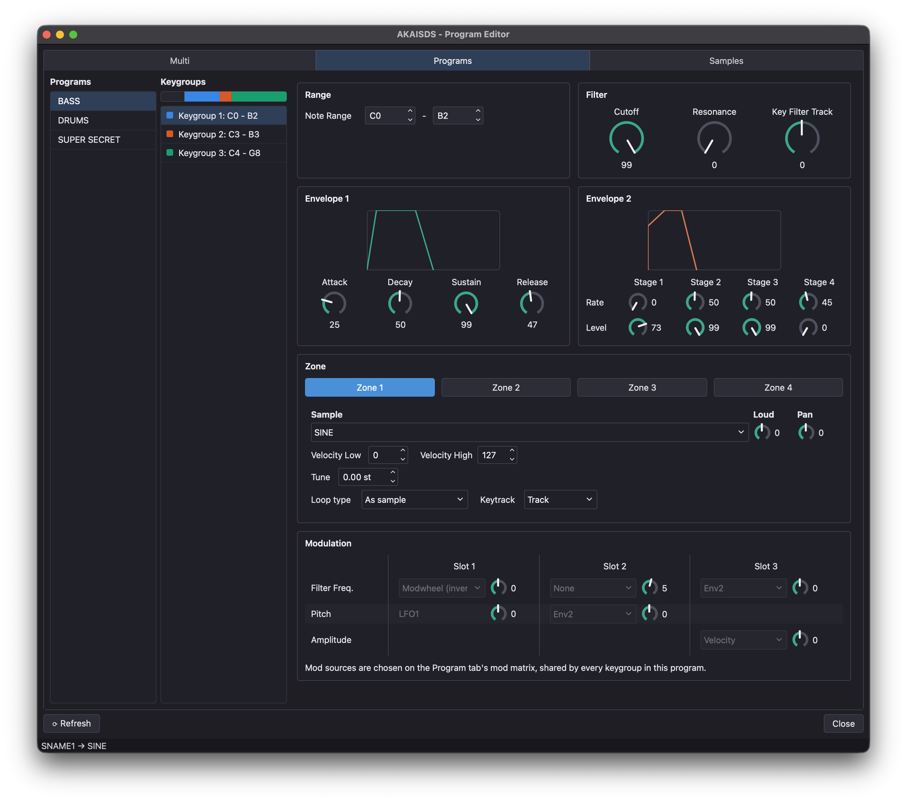
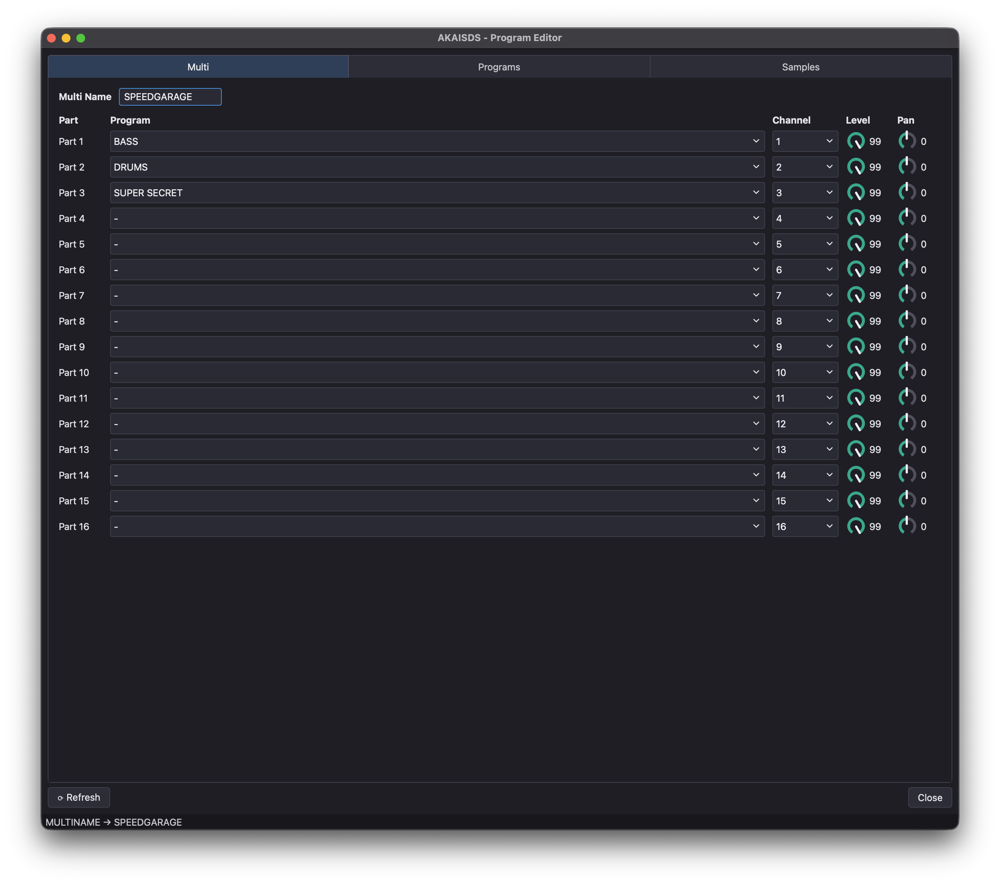
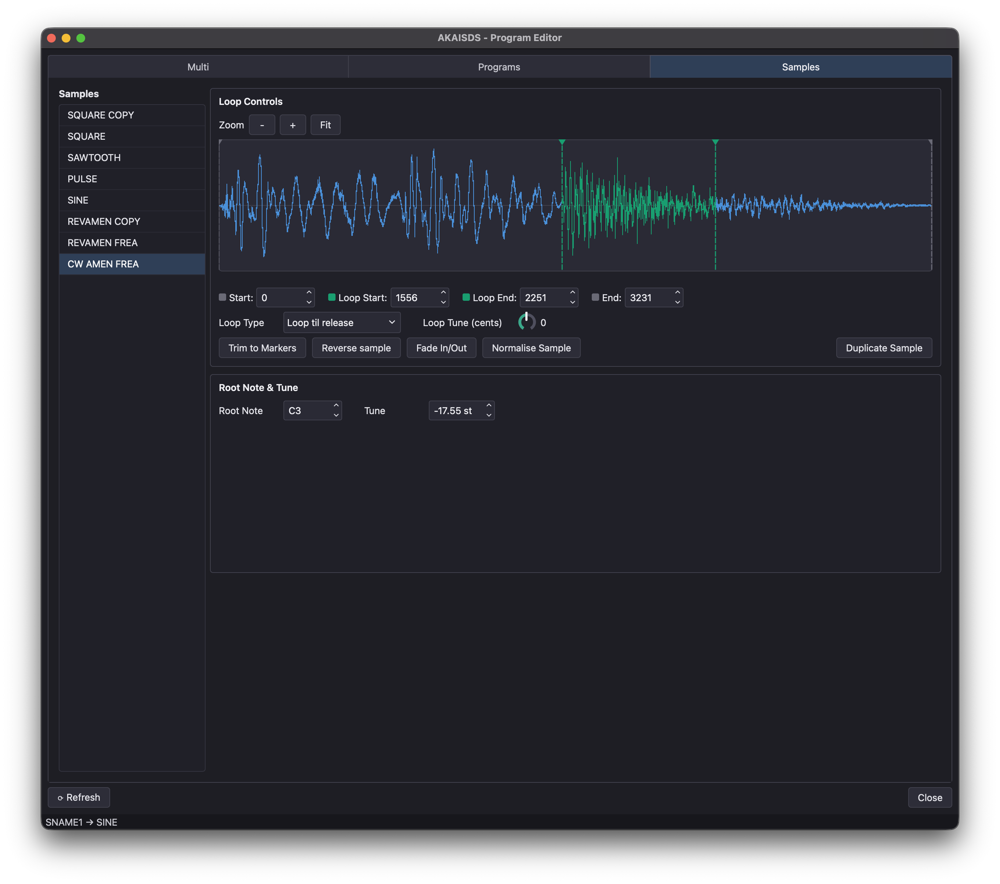

# AKAISDS

A simple way to send and receive audio samples (WAV, AIFF, FLAC) to an Akai S1000/S2000/S3000 series sampler over MIDI using the sample dump standard (MIDI SDS). Also supports generic MIDI SDS transmission for non-Akai samplers.

## Features

- Akai-native sample browsing & management (list, rename, delete) as well as universal generic SDS support for non-Akai hardware
- Program, Keygroup and Sample editor for Akai S2000/S3000 series samplers
- WAV/AIFF/FLAC support
- Drag-and-drop support for adding samples
- Batch transmission queue for sending and receiving samples
- Sampler memory status bar to display how much RAM is free (Akai sampler specific only)
- Open-loop fallback for one-way MIDI cable setups, including timeout detection if a cable is unplugged mid-transfer
- Built in MIDI diagnostic tests
  - MIDI interface test to check if your interface can support MIDI SysEx traffic
  - Hardware connection test to check if your MIDI sampler is connected correctly
- Native builds for macOS (Apple Silicon & Intel), Linux and Windows (note that Windows support has not been thoroughly tested yet)

## Quick Start & Screenshots

See [Quick Start Guide](src/ui/help/quickstart.md) for a walkthrough of connecting your sampler, queuing up files and sending your first sample dump, along with approximate transfer times per sample rate/bit depth. The same guide is also available in-app via **Help > Quick Start Guide**.

## Download & Installation

Download the latest release from the Releases tab on GitHub.

#### macOS Instructions

Unzip the download and drag AKAISDS to your applications folder. See the disclaimer section below for instructions about how to bypass Gatekeeper security.

#### Windows Instructions

Unzip the download and run AKAISDS-Setup.exe to install. It should create a shortcut on your Desktop and in your Start Menu. I'm not much of a Windows user, so if you happen to know more about creating Windows installers, your contribution would be much appreciated - see [CONTRIBUTING](CONTRIBUTING.md). See the disclaimer section below for instructions about how to bypass Windows SmartScreen & Defender.

#### Linux Instructions

Unzip the download and run the AKAISDS AppImage from any directory. Depending on your distribution you may need to run `chmod +x AKAISDS-x86_64.AppImage` to allow execution. No security tweaks should be necessary, at least not on Ubuntu 26.04 LTS. I am currently looking into packaging AKAISDS in different Linux package formats. If you are knowledgeable about Linux packaging formats, I would LOVE a hand - see [CONTRIBUTING](CONTRIBUTING.md).

## Disclaimer

macOS and Windows builds WILL trigger security warnings. This is because the code hasn't been "signed". For an open source project maintained and developed by a single person (who is also working on this in their free time), paying for a code signing license is difficult to justify right now. I am currently looking in to alternatives and ways around this. For now, the builds are safe (just trust me bro), but if you're concerned, you're welcome to download the source code, inspect it and build it on your own machine.

To bypass macOS Gatekeeper you will need to do the following:

1. Attempt to open the app normally
2. Open System Settings and scroll down to Privacy & Security
3. Scroll down and click "Open Anyway"
4. You will be prompted to authenticate with your password or Touch ID
5. ???
6. Profit

To bypass Windows SmartScreen & Defender you will need to do the following:

1. Delete Windows 11 immediately and switch to Linux
2. Fine, if you insist on Windows: open Windows Security → Virus & threat protection → Protection history, find AKAISDS-Setup.exe in the list and restore it.
3. To stop it happening on every future download: same app → Manage settings → Exclusions → Add an exclusion → File → Select AKAISDS-Setup.exe
4. Alternatively you can build AKAISDS on your machine locally and it _might_ potentially bypass Windows Defender, but YMMV

Generic SDS mode has been implemented and tested via simulation but only has limited verification on real hardware. Bugs will likely be present, so if you encounter one please log an issue on GitHub and be as descriptive as possible :) See [CONTRIBUTING.md](CONTRIBUTING.md#reporting-bugs) for what's helpful to include.

Note that some USB MIDI interfaces do not support MIDI SysEx messages. Please check your MIDI hardware supports SysEx transmission. AKAISDS contains a MIDI SysEx loopback test to assess MIDI interface compatibility. Otherwise please check the table below for a list of tested hardware. If you've tested your interface, please feel free to contribute and add your findings to the table below.

|Interface|macOS|Linux|Windows|Notes|
|---|---|---|---|---|
|   iCON MIDIPORT V1.01  |❌ |  ⚠️ |  ⚠️ |  Max SysEx 256 bytes |
|  MIDIPLUS MIDI 2x2 |  ⚠️ |  ⚠️ |  ⚠️ |  Max SysEx 256 bytes |
|   PreSonus Studio 26  |  ✅ |  ✅ |  ⚠️ (max 512 bytes) | Requires driver on Windows  |

## Building From Source

Want to build AKAISDS yourself or help contribute to the project? See [BUILDING.md](BUILDING.md) for setup instructions, [TESTING.md](TESTING.md) for how the test suite works, and [CONTRIBUTING.md](CONTRIBUTING.md) for everything else

## License & Acknowledgements

Licensed under [GPLv3](LICENSE) - see [LICENSE](LICENSE) for details

Written in Python using PySide6 (Qt), mido, python-rtmidi, soundfile, s3ked and Nuitka.

This project would not have been possible without the amazing work of Frank Neumann who transcribed the entire Akai SysEx implementation by hand from printed documentation. [That documentation can be found here](https://lakai.sourceforge.net/documentation.shtml.html)

Additionally the program and keygroup editor is built on top of the [s3ked](https://github.com/lentferj/s3ked) project by _Jan Lentfer._

_I stand on the shoulders of giants._

I make exactly zero dollars from AKAISDS. If you find this project useful in any way shape or form, I would appreciate any support you can offer, be it by spreading the word of AKAISDS, [donating via Ko-Fi](https://ko-fi.com/martincurkovic) or by [listening to my music](https://martin.fanlink.tv/putitdown) on whatever platform works best for you (sketchy torrent sites included).

Much love,

Martin Curkovic

---
