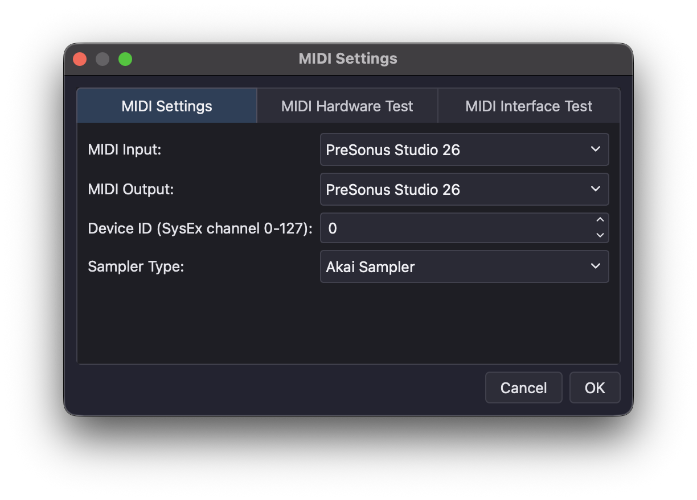
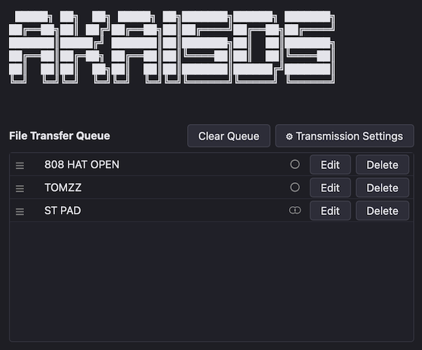
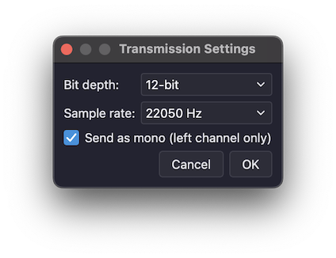

# AKAISDS Help

**Contents:**

- [MIDI Setup](#midi-setup)
- [Sending & Receiving Samples](#sending--receiving-samples)
- [Program & Keygroup Editor](#program--keygroup-editor)
- [MIDI Troubleshooting & Diagnostics](#midi-troubleshooting--diagnostics)

## MIDI Setup

**1. Connect your sampler**

Connect your sampler to your MIDI interface. The MIDI output of your sampler should be connected to your interface's MIDI input, and vice versa.

**2. Open MIDI Settings**

Select your MIDI Input/Output ports and choose your sampler type (Akai or Generic SDS). Select your SysEx channel (0 is the default for almost all MIDI hardware).

You can test your MIDI setup in the **MIDI Hardware Test** tab. If you're having connectivity issues, check your MIDI connections to ensure they are not reversed. If you still don't see your sampler listed in the MIDI Hardware Test tab, see [MIDI Troubleshooting & Diagnostics](#midi-troubleshooting--diagnostics) for details.

## Sending & Receiving Samples

**1. Drag audio files into the queue**

WAV, AIFF and FLAC are all supported. Dragging in entire folders works too. AKAISDS does not support compressed formats like MP3.

**2. Adjust quality settings (optional)**

You can set quality globally via the Transmission Settings button or individually via the Edit button next to each sample. Reducing quality will significantly reduce the transfer time (MIDI Sample Dumps are notoriously slowwwww 🐌).

**3. Hit Send!**

If you've never used MIDI sample dumps before, expect them to be slow. Very slow. Reducing bit depth or sample rate will help speed up the transfer, at the expense of sound quality.

**Receiving Samples**

In the right hand list of *Currently Loaded Samples*, select which samples you would like to receive from the sampler. Then click the *Receive Samples* button, which will then ask where you want to save the samples. Transmission will commence once you have selected a location to save the received samples.

**Approximate transfer times for a 5-second sample:**

|  Sample Rate |  16-bit |  8-14 bit |
|---|---|---|
|  44100 Hz |  ~3.7 min |  ~2.5 min |
|  30000 Hz |  ~2.5 min |  ~1.7 min |
|  22050 Hz |  ~1.9 min |  ~1.2 min |
|  15000 Hz |  ~1.3 min |  ~50 sec |
|  11025 Hz |  ~56 sec |  ~37 sec |
|  8000 Hz |  ~41 sec |  ~27 sec |

Note that **bit depth** is a two-tier step, not a smooth scale. An 8-bit sample will take just as long as a 14-bit sample to transfer. So there is no benefit to reducing to less that 14-bit specifically for speed. Reducing **sample rate** does scale linearly. Half the sample rate means half the transfer time, but at the expense of higher frequency audio content.

These are theoretical best-case figures based on MIDI's fixed wire speed of 31,250 baud. Real world transfers may be slower, depending on how quickly your specific sampler responds to each data packet.

## Program & Keygroup Editor

**IMPORTANT!** The editor function is quite new and may have unexpected bugs. It is *strongly* recommended to back up your data before use.

The editor is powered under the hood by *s3ked*. It offers control over the most commonly used functions in an Akai S2000 and S3000 series samplers. Not all functions have controls (yet). The intention was to keep the interface as easy to understand as possible at first glance.

Akai S1000 series samplers will likely work for most controls too, with the obvious exception of the Multi tab.

By default the editor opens up on the Programs page. It will take a second or two to load, especially if you have lots of Programs and Keygroups on your Akai sampler.

This is not an extensive deep dive into the editing functions of an Akai sampler, it is assumed you are already familiar with the workflow of Akai samplers.

### Programs Tab

To create new Programs or Keygroups, right click on an existing Program or Keygroup, then click *Duplicate Program...* or *Duplicate Keygroup...*

To open the Keygroup settings, select a Keygroup in the list. To go back to the Program settings page, select a Program in the list.

### Multi Tab

The Multi tab is where you can assign Programs to various parts of a Multi. You can also rename your Multi if desired.

### Samples Tab

The Samples tab is where you can edit loop points, trim samples, rename samples, fade samples in and out, normalise samples and reverse samples.

The list of samples will appear on the left. You can right click a sample to delete or rename it.

To load the sample's waveform, double click on the placeholder window. Loading of a sample's waveform is very slow (same speed as sending and receiving samples over SDS). It will also freeze the interface until loading is complete.

Loop points and sample start/edit markers can be edited visually without needing to load the sample's waveform. Hold down *Shift* when dragging sample markers around for more precision. Alternatively you can type a value in to the boxes below the waveform.

Trimming a sample, reversing a sample, fading in and out of a sample and normalising the gain of a sample is done by the host computer. The waveform must be loaded to the computer and then the edited sample will be sent back in place to the Sampler via SDS (slow). It will overwrite the sample you are editing. There is no undo button, you have been warned.

### Refreshing Sampler Data

If you edit a parameter on the front display of your sampler, the edit is unlikely to be picked up by AKAISDS automatically. To get around this, you can use the *Refresh* button on the bottom left of the window (or by pressing Command + R or Ctrl + R depending on your platform).

## MIDI Troubleshooting & Diagnostics

There are 2 MIDI tests in the AKAISDS Settings window.

1. [MIDI Hardware Test](#midi-hardware-test)
2. [MIDI Loopback Test](#midi-loopback-test)

### MIDI Hardware Test

Use the Hardware test to check if your MIDI sampler is detected by your interface.

To use the hardware test, connect a MIDI cable from your MIDI interface's output to the sampler's input, and vice versa. Both input and output connections are required for this test.

Click the *Run Hardware Test* button and if successful, your sampler's details should appear in the window.

### MIDI Loopback Test

Use the Loopback Test to check if your MIDI interface can support MIDI SysEx traffic. Not all interfaces have full SysEx support.

To use the loopback test, take a MIDI cable and connect one end to the MIDI input of your interface, and the other end to the MIDI output of the same interface (ie, back into itself). Then click the *Run Loopback Test* button. The test may take up to 30 seconds depending on your hardware.

Loopback test results will be shown in a dialog box.

There is a table in the README of the GitHub repository of interfaces that have been tested using this method. If your interface isn't listed there, I encourage you to help out the community by uploading your results (either by submitting a Pull Request or by getting in touch directly).

